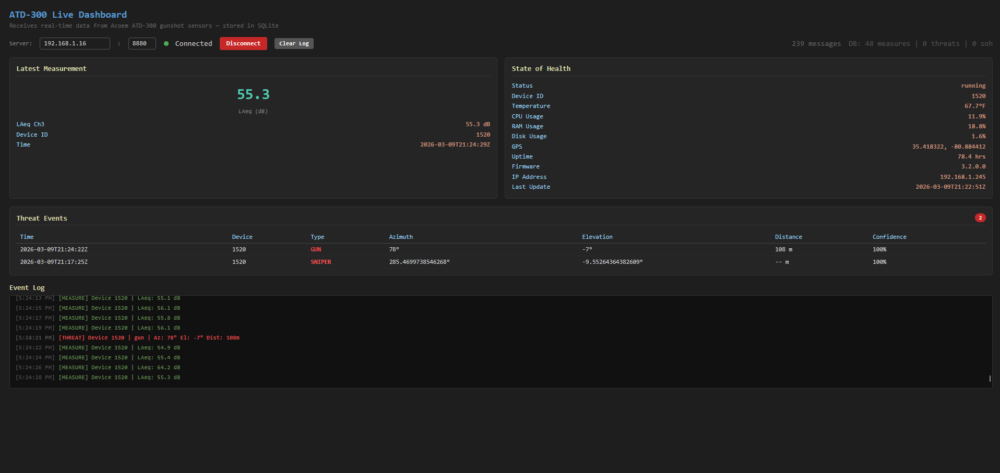
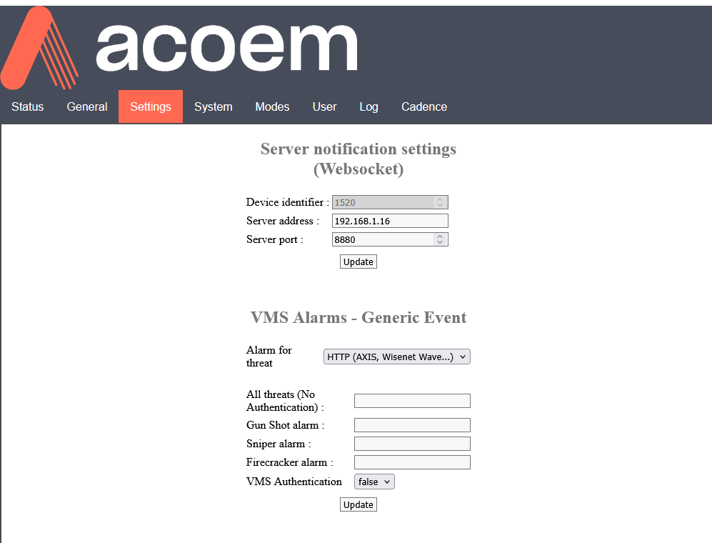

# ATD-300 Listener

A real-time TCP listener and dashboard for **Acoem ATD-300 gunshot detection sensors**. The server receives JSON data from sensors over TCP, stores it in a local SQLite database, and streams live updates to a browser-based dashboard via Server-Sent Events (SSE).



## Architecture

```
ATD-300 Sensor ──POST──► listener.php (ReactPHP TCP) ──► SQLite DB
                                 │
                                 ├── SSE /events ──► index.html (Live Dashboard)
                                 └── REST API ──────► any HTTP client
```

## Features

- **Async TCP server** powered by [ReactPHP](https://reactphp.org/) — handles sensor connections and browser clients on a single port
- **SQLite storage** with WAL mode for concurrent read/write
- **Live dashboard** (`index.html`) with real-time updates via SSE
- **Three data types** parsed and stored:
  - **Measures** — LAeq noise levels (dB)
  - **State of Health (SOH)** — device status, temperature, CPU/RAM/disk usage, GPS, firmware, uptime
  - **Threats** — gunshot detections with type, probability, azimuth, elevation, and distance
- **REST API** for querying stored data
- **Raw listener** (`raw_listener.php`) for low-level debugging of sensor traffic

## Requirements

- PHP 8.0+ with the `sqlite3` extension
- [Composer](https://getcomposer.org/)

## Installation

```bash
git clone <repo-url> atd-listener
cd atd-listener
composer install
```

## Usage

### Start the listener

```bash
php listener.php
```

The server starts on **port 8880** and prints:

```
=== ATD-300 Listener on port 8880 ===
  Sensor:    POST /measure | /soh | /threat
  Dashboard: GET  /events (SSE)
  API:       GET  /api/threats | /api/measures | /api/soh | /api/stats
  Database:  db/atd300.sqlite3
  Waiting for data...
```

Alternatively, use the included helper script:

```bash
./go.sh        # runs listener.php in the background
```

### Open the dashboard

Open `index.html` in a browser. Enter the ATD-300 pod host/IP and port (defaults to `192.168.1.16:8880`), then click **Connect**. The dashboard will:

1. Load historical data from the API
2. Subscribe to the SSE stream for live updates
3. Display the latest measurement, SOH status, and a scrollable threat event table

### Raw debugging

To see exactly what bytes the sensor sends (useful for protocol debugging):

```bash
php raw_listener.php
```

This prints raw data and hex dumps for every incoming connection on port 8880.

## API Endpoints

| Method | Path | Description |
|--------|------|-------------|
| `GET` | `/` | Health check — returns `ATD-300 Listener OK` |
| `GET` | `/events` | SSE stream of live sensor events |
| `GET` | `/api/threats?limit=50` | Recent threat detections (JSON) |
| `GET` | `/api/measures?limit=50` | Recent noise measurements (JSON) |
| `GET` | `/api/soh` | Latest state-of-health record (JSON) |
| `GET` | `/api/stats` | Total counts for measures, threats, and SOH records |
| `POST` | `/measure` | Ingest a measurement from a sensor |
| `POST` | `/soh` | Ingest a state-of-health report from a sensor |
| `POST` | `/threat` | Ingest a threat detection from a sensor |

## Database

Data is stored in `db/atd300.sqlite3` with three tables:

- **measures** — `device_id`, `laeq`, `laeq_chan3`, `sensor_datetime`, `received_at`, `raw_json`
- **soh** — `device_id`, `status`, `temp`, `cpu_usage`, `ram_usage`, `disk_usage`, `latitude`, `longitude`, `uptime`, `fw_version`, `ip`, `orientation`, `sensor_datetime`, `received_at`, `raw_json`
- **threats** — `device_id`, `threat_type`, `probability`, `azimuth`, `elevation`, `distance`, `fw_version`, `nn_version`, `sensor_datetime`, `received_at`, `raw_json`

The database directory and tables are auto-created on first run. Schema mismatches are detected and tables are recreated automatically.

## Project Structure

```
├── listener.php        # Main async TCP server (ReactPHP)
├── raw_listener.php    # Raw TCP debug listener
├── index.html          # Live browser dashboard
├── composer.json        # PHP dependencies (react/socket)
├── go.sh               # Convenience startup script
├── db/                 # SQLite database (auto-created)
│   └── atd300.sqlite3
└── vendor/             # Composer dependencies
```
## Acoem ATD-300 Setup

Login to configure and setup the ATD-300 for testing.  

Go to the Settings page and set the Server notification settings to match your server:



Then go to the Modes tab and send a Gun Shot event of any king to simulate a gunshot.
Alternatively you can put it in test mode or generate real gunshot events.


## License

See individual dependency licenses in `vendor/`.

---

*Acoem, Cadence, and ATD-300 are property or registered trademarks of Acoem. This project is not affiliated with or endorsed by Acoem.*
